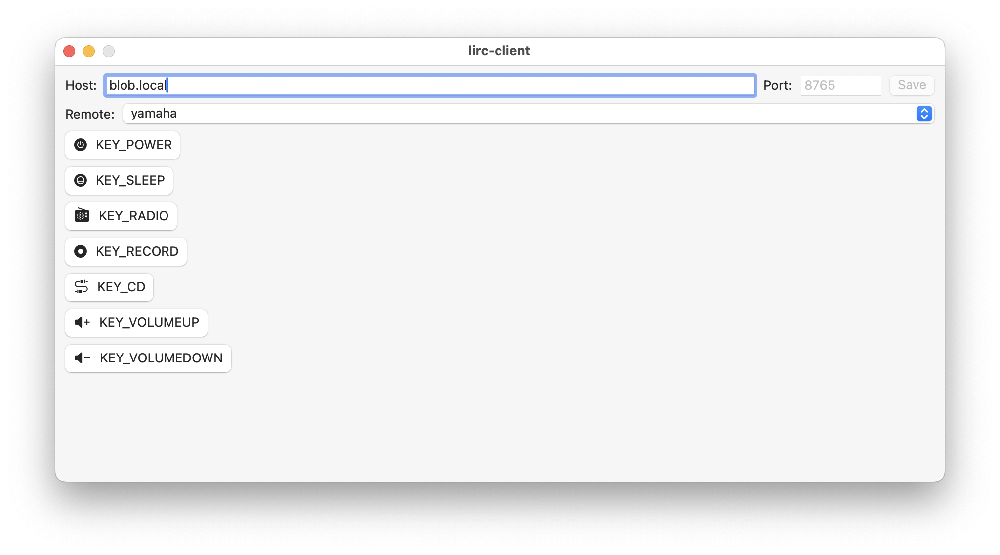

# lirc-client

This is a native MacOS application which connects to a [LIRC](https://www.lirc.org) daemon running somewhere on the network. It can discover which LIRC remotes are available, and for each remote, presents buttons for each command supported by the remote.

This is, at present, extremely ugly and only works on MacOS. I wanted a way to control my pre-internet stereo without leaving the couch. I can verify that it works with a particular remote set (for my Yamaha stereo receiver, which receives infrared commands from a wired IR repeater) but it should work for other remotes too.

Let me know if this is useful, would be happy to make it better! I may at some point create an iOS target for it, too.
